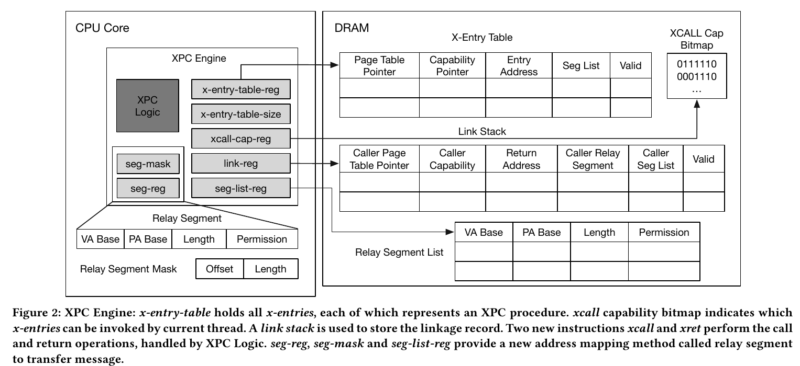
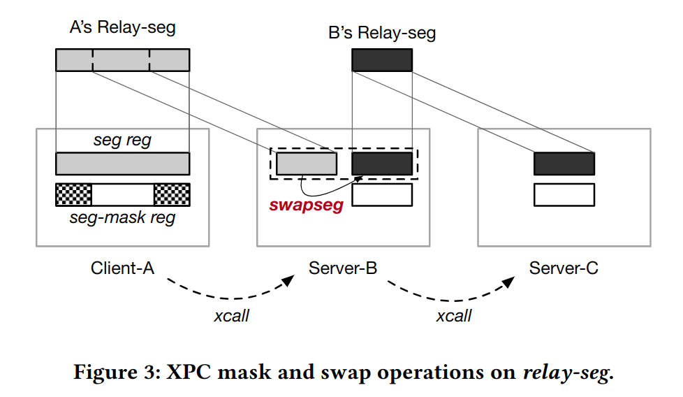

# SkyBridge and XPC

## 背景

- 陈老师推荐的有关微内核的两篇论文，一篇讲软件层面的优化，一篇讲硬件层面的优化
- 两篇论文都是上交陈海波团队发表的，微内核可能会应用在鸿蒙OS中

## SkyBridge

- 论文多次提到熔断漏洞，近几年受到广泛关注和研究的安全性问题；
- 微内核最关键的机制是核间通信，在用户层实现很多系统级应用，内核只保留最基本的功能；传统的进程通信依赖于内核进程切换，带来了巨大的开销
- seL4的fastpath IPC
- SkyBridge 提出了一些应用 VMFUNC 的方法：
  - 位于microkernel下方的Rootkernel，使用巨页避免microkernel频繁触发缺页中断；采用Subkernel和Rootkernel两级分管
  - SkyBridge巧妙地将Client的CR3映射为对应Server的CR3，Client通过EPTP list来指向不同Server的EPT
  - 安全机制在kernel处理IPC，SkyBridge检查process的二进制文件避免非法VMFUNC，通过查表来验证IPC请求
- Rootkernel:
  - 从Subkernel启动，通过VMCALL与Subkernel通信
  - 确保大多数VM行为不触发VM exit，VM exits包含三类：
    - 特权指令：不触发VM exits
    - 硬件中断：直接将中断交给microkernel处理
    - EPT异常（miss，invalid）：Subkernel到Rootkernel采用1GB的页，SkyBridge仅为Rootkernel保留100MB的物理空间，减少TLB miss等问题出现的次数和开销
- Subkernel：
  - server注册：将trampoline code page和stack pages映射到server的虚拟地址空间，为server分配ID
  - client注册：绑定到指定ID的server，同样进行映射；EPT处理，将client的CR3映射到server的CR3；将所有和server有关的EPTP添加到client的EPTP list
  - 跨虚拟地址空间执行时陷入内核的问题：Subkernel可以记录进程的信息来判断
- Rewriting Illegal VMFUNC:
  - 替换VMFUNC指令，若只有一条指令，则直接替换，若需要执行多条指令，则替换为跳转指令，跳转到待执行代码再返回
  - （具体策略和x86的指令编码有关，暂时还没有深入学习x86体系结构）

## XPC

- 硬件层面优化IPC性能的实现，我理解为新的进程管理方法，通过引入更复杂的硬件设计来适应microkernel对IPC的高度依赖，有硬件操作系统的趋势？
- 存在的问题：
  - 解决不了多核跨进程通信问题
  - 设计较为复杂，但安全方面可能比较薄弱，论文中只采用了控制位和预设的物理空间来进行安全检查（可能通过硬件漏洞直接窃听内存中的通信数据
- 实现高性能IPC的两个重要层面：
  - 如何摆脱kernel带来的开销：
    - 陷入和恢复
    - IPC 相关执行逻辑
    - 进程上下文切换
  - 如何实现无拷贝通信
- 设计目标：
  - 无陷入进程切换
  - 无拷贝进程通信
  - 适应现有内核
  - 尽可能简化硬件设计
- 基本组成：
  - x-entry:区分ID，访问权限控制xcall-cap
  - xcall和xret指令：快速的进程切换
  - 地址映射策略relay-seg：使用寄存器保存message在内存中的基址和范围；进程间原子性拥有message控制权，避免TOCTOU攻击
  - migrating thread model: ？
- Zircon通过异步IPC模拟文件系统接口的同步语义带来了高昂的开销
- seL4的IPC处理机制，检查以下条件来判断是否采用slowpath还是fastpath：
  - 通信双方有不同的特权级别
  - 通信双方位于不同的核上
  - message大小是否超出寄存器大小但未超过buffer大小
  - 这些机制可以通过硬件并行化来降低延迟
- seL4的IPC通信机制，根据消息长度采用三种策略：寄存器、IPC buffer、shared memory；并不安全，多线程可以篡改数据？
- XPC engine：

- xcall #reg:
  - 访问bitmap检查xcall-cap
  - 访问x-entry-table并检查valid标志位
  - 将恢复需要的信息推入link stack中
  - 指向callee页表，pc跳转到目标进程entry point，保存caller的信息
- xret：
  - 将link stack的栈顶弹出，检查valid标志位，并根据信息返回caller进程（嵌套？）
- xcall-cap：xcall-cap-reg保存bitmap在内存中的基址
- link stack：可以非阻塞方式写stack
- cached x-entries：利用prefetch，进程可提前将x-entry加载到cache
- swapseg #reg: reg-seg和seg-list中的一项交换内容：

