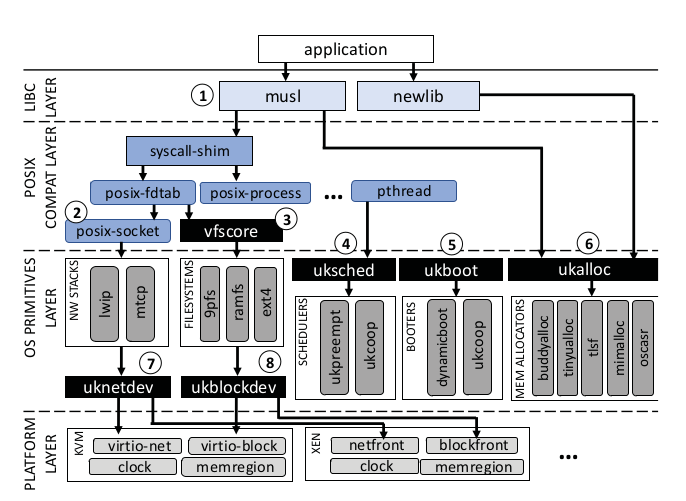

-------------
Unikraft
-------------

    https://unikraft.org/docs/getting-started/

    https://asplos22.unikraft.org/

    https://github.com/unikraft/unikraft

======
概述
======

.. admonition:: What is Unikernel ?

    - fast instantiation (实例化) times (tens of milliseconds or less)
    - tiny memory footprints (内存占用) (a few MBs or even KBs)
    - high network throughput (10-40GB/s)
    - high consolidation (整合性) (being able to run thousands of instances on a single commodity server)
    - a reduced attack surface and the potential for easier (如何体现安全性？)

..

    Defining a small set of APIs for core OS components that makes it easy to replace-out a component when it is not needed, and to pick-and-choose from multiple implementations of the same component when performance dictates.

**Unikraft** 设计思想：保留 **Unikernel** 的特性，解决应用的移植开销问题，在性能和移植性上作出权衡，可以进行灵活的配置。

.. admonition:: What is `Unikraft <https://arxiv.org/abs/2104.12721>`_ ?

    - Standard image with lots of unnecessary code; specialized image needs lots of development efforts.
    - Unikraft: a system that automatically builds a lean, high performance image for the application and the platforms.

**Unikraft** 构建镜像流程：

- Select application
- Select configured libs (main lib, platform lib, arch lib)
- Build
- Run with Unikernel binaries

.. admonition:: Library pools

    1. the architecture library tool, containing libraries specific to a computer architectur.
    2. the platform tool, where target platforms can be Xen, KVM, bare metal and user-space Linux.
    3. the main library pool, containing a rich set of functionality to build the unikernel form.

    Main library: 

    1. Drivers (both virtual such as netback/netfront) and physical such as ixgbe
    2. Filesystems
    3. Memory allocators
    4. Schedulers
    5. Network stacks
    6. Standard libs (libc, openssl)
    7. Runtimes (Python interpreter, debugging and profiling tools)

..

   - Perf: 1.7x-2.7x performance improvement compared to Linux guests
   - Image size: images for these apps are around 1MB
   - Memory footprint: require less than 10MB of RAM to run
   - Boot: boot in around 1ms on top of the VMM time 

关于性能测试， **Unikraft** 声称在镜像大小、引导时间、运行性能上都取得了非常好的效果。

=========
源码分析
=========

论文中的这张图非常清晰地给出了 **Unikraft** 的设计架构，从设计架构出发，可以对 `源码 <https://github.com/unikraft/unikraft>`_ 进行简要的分析。
（ lib 文件夹把所有的模块都平铺在一块，这也是之后在设计 OS 时需要注意的问题，没有这张图就很难找到头绪）

+++++++++
ukalloc
+++++++++

- a POSIX compliant external API
- an internal allocation API called ukalloc
- one or more backend allocator implementations

.. code-block:: c
    :linenos:

    struct uk_alloc;
    typedef void* (*uk_alloc_malloc_func_t)
		(struct uk_alloc *a, __sz size);
    struct uk_alloc {
        /* memory allocation */
        uk_alloc_malloc_func_t malloc;
        // ...
        /* internal */
        struct uk_alloc *next;
        __u8 priv[];
    };

++++++++++++++++++++
ukplat_memregion
++++++++++++++++++++

**Unikraft** 为不同平台（KVM、Linuxu 等）下的内存管理提供 `ukplat_memregion*` 相关接口。

.. code-block:: c
    :linenos:

    /* Descriptor of a memory region */
    struct ukplat_memregion_desc {
        void *base;
        __sz len;
        int flags;
    #if CONFIG_UKPLAT_MEMRNAME
        const char *name;
    #endif
    };
    /**
    * Returns the number of available memory regions
    * @return Number of memory regions
    */
    int ukplat_memregion_count(void);
    /**
    * Reads a memory region to mrd
    * @param i Memory region number
    * @param mrd Pointer to memory region descriptor that will be filled out
    * @return 0 on success, < 0 otherwise
    */
    int ukplat_memregion_get(int i, struct ukplat_memregion_desc *mrd);

+++++++++
ukboot
+++++++++

Unikraf 在 ukboot 中对 memory allocator 等模块进行初始化，根据编译选项（ ``CONFIG_LIBUKALLOC`` 等），选择对应的接口实现。

.. code-block:: c
    :linenos:

    /* defined in <uk/plat.h> */
    void ukplat_entry(int argc, char *argv[])
    {
        struct thread_main_arg tma;
        int kern_args = 0;
        int rc __maybe_unused = 0;
    #if CONFIG_LIBUKALLOC
        struct uk_alloc *a = NULL;
    #endif
    #if !CONFIG_LIBUKBOOT_NOALLOC
        struct ukplat_memregion_desc md;
    #endif
    #if CONFIG_LIBUKSCHED
        struct uk_sched *s = NULL;
        struct uk_thread *main_thread = NULL;
    #endif

    // ...

    #if !CONFIG_LIBUKBOOT_NOALLOC
        /* initialize memory allocator */
        ukplat_memregion_foreach(&md, UKPLAT_MEMRF_ALLOCATABLE) {

            /* try to use memory region to initialize allocator
            * if it fails, we will try  again with the next region.
            * As soon we have an allocator, we simply add every
            * subsequent region to it
            */
            if (!a) {
    #if CONFIG_LIBUKBOOT_INITBBUDDY
                a = uk_allocbbuddy_init(md.base, md.len);
                // Other implementations...
    #endif
            } else {
                uk_alloc_addmem(a, md.base, md.len);
            }
        }
        rc = ukplat_memallocator_set(a);
    #endif

    #if CONFIG_LIBUKALLOC
        rc = ukplat_irq_init(a);
    #endif

        ukplat_time_init();

    #if CONFIG_LIBUKSCHED
        /* Init scheduler. */
        s = uk_sched_default_init(a);
    #endif

        tma.argc = argc - kern_args;
        tma.argv = &argv[kern_args];

    #if CONFIG_LIBUKSCHED
        main_thread = uk_thread_create("main", main_thread_func, &tma);
        uk_sched_start(s);
    #else
        /* Enable interrupts before starting the application */
        ukplat_lcpu_enable_irq();
        main_thread_func(&tma);
    #endif
    }

+++++++++
uksched
+++++++++

_________
uk_thread
_________

.. code-block:: c
    :linenos:

    struct uk_thread {
        const char *name;
        void *stack;
        void *tls;
        void *ctx;
        UK_TAILQ_ENTRY(struct uk_thread) thread_list;
        uint32_t flags;
        __snsec wakeup_time;
        bool detached;
        struct uk_waitq waiting_threads;
        struct uk_sched *sched;
        void (*entry)(void *);
        void *arg;
        void *prv;
    #ifdef CONFIG_LIBNEWLIBC
        struct _reent reent;
    #endif
    #if CONFIG_LIBUKSIGNAL
        /* TODO: Move to `TLS` and define within uksignal */
        struct uk_thread_sig signals_container;
    #endif
    };

``struct thread`` 结构类型与传统定义方式类似，内部含有上下文指针、栈指针、状态位等。

以 ``uk_thread_init`` 函数为例，可以看出 **Unikraft** 模块解耦的特点。通过调用注册的内存管理模块中的函数来完成线程上下文的创建。
此外，线程对外提供了初始化接口 ``struct uk_thread_inittab_entry::init``，可以进一步自定义初始化方法。

.. code-block:: c
    :linenos:

    int uk_thread_init(
        struct uk_thread *thread, 
        struct ukplat_ctx_callbacks *cbs, 
        struct uk_alloc *allocator,
		const char *name,
        void *stack,
        void *tls,
		void (*function)(void *),
        void *arg) {
        // ...
        /* Allocate thread context */
        ctx = uk_zalloc(allocator, ukplat_thread_ctx_size(cbs));
        if (!ctx) {
            ret = -1;
            goto err_out;
        }
        // ...
        /* Iterate over registered thread initialization functions */
        uk_thread_inittab_foreach(itr) {
            ret = (itr->init)(thread);
            if (ret < 0)
                goto err_fini;
        }
        // ...
        err_fini:
            /* Run fini functions starting from one level before the failed one
            * because we expect that the failed one cleaned up.
            */
            uk_thread_inittab_foreach_reverse2(itr, itr - 2) {
                (itr->fini)(thread);
            }
            uk_free(allocator, thread->ctx);
        // ...
    }

_________
uk_sched
_________

.. code-block:: c
    :linenos:

    struct uk_sched {
        uk_sched_yield_func_t yield;
        
        // ...

        /* internal */
        bool threads_started;
        struct uk_thread idle;
        struct uk_thread_list exited_threads;
        struct ukplat_ctx_callbacks plat_ctx_cbs;
        // bind to memory allocator
        struct uk_alloc *allocator;
        struct uk_sched *next;
        void *prv;
    };

ukboot 的入口中，对调度器进行了初始化。在调用 ``uk_thread_create`` 后创建主线程，并调用 ``uk_sched_start`` 开始执行线程。
这个主线程绑定到用户自定义的 ``main`` 函数，默认采用 Weak Symbol 的方式，如果没有实现就直接 panic。

.. code-block:: c
    :linenos:
    
    // defined in lib/ukboot/boot.c
    #if CONFIG_LIBUKSCHED
        main_thread = uk_thread_create("main", main_thread_func, &tma);
        uk_sched_start(s);
    #else

    // defined in lib/uksched/sched.h
    /* Set s as the default scheduler. */
    int uk_sched_set_default(struct uk_sched *s);
    // Other APIs...

从 ``uksched`` 的整体设计来看， ``uksched`` 依赖于 ``ukalloc`` 的实现（创建 uk_thread 和 uk_sched 实例等），需要调用内存管理的接口。
所以图中的两个部分严格上来讲应该存在依赖关系（涉及到未来可能引入的 Fault Isolation 问题）。

+++++++++
uklock
+++++++++

.. TODO

=========
总结
=========

