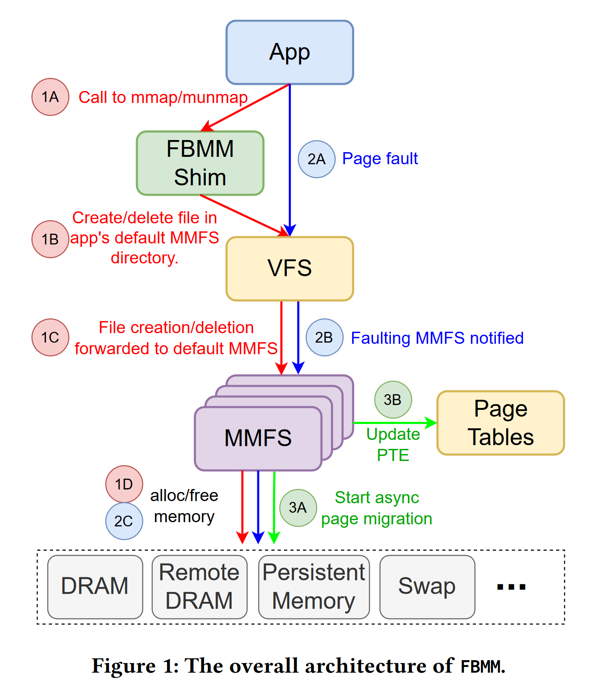
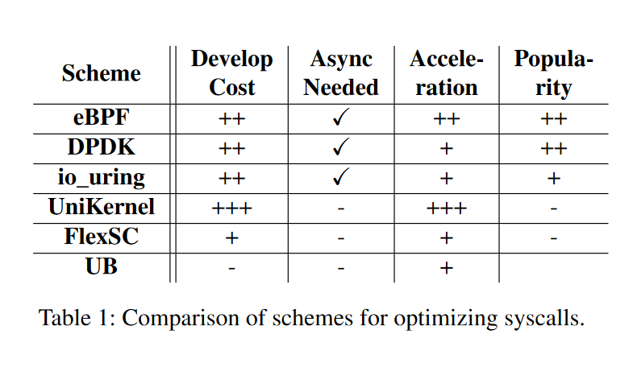

# 阅读笔记

## XPC

- 硬件层面优化IPC性能的实现，我理解为新的进程管理方法，通过引入更复杂的硬件设计来适应microkernel对IPC的高度依赖，有硬件操作系统的趋势？
- 存在的问题：
  - 解决不了多核跨进程通信问题
  - 设计较为复杂，但安全方面可能比较薄弱，论文中只采用了控制位和预设的物理空间来进行安全检查（可能通过硬件漏洞直接窃听内存中的通信数据
- 实现高性能IPC的两个重要层面：
  - 如何摆脱kernel带来的开销：
    - 陷入和恢复
    - IPC 相关执行逻辑
    - 进程上下文切换
  - 如何实现无拷贝通信
- 设计目标：
  - 无陷入进程切换
  - 无拷贝进程通信
  - 适应现有内核
  - 尽可能简化硬件设计
- 基本组成：
  - x-entry:区分ID，访问权限控制xcall-cap
  - xcall和xret指令：快速的进程切换
  - 地址映射策略relay-seg：使用寄存器保存message在内存中的基址和范围；进程间原子性拥有message控制权，避免TOCTOU攻击
  - migrating thread model: ？
- Zircon通过异步IPC模拟文件系统接口的同步语义带来了高昂的开销
- seL4的IPC处理机制，检查以下条件来判断是否采用slowpath还是fastpath：
  - 通信双方有不同的特权级别
  - 通信双方位于不同的核上
  - message大小是否超出寄存器大小但未超过buffer大小
  - 这些机制可以通过硬件并行化来降低延迟
- seL4的IPC通信机制，根据消息长度采用三种策略：寄存器、IPC buffer、shared memory；并不安全，多线程可以篡改数据？
- XPC engine：

- xcall #reg:
  - 访问bitmap检查xcall-cap
  - 访问x-entry-table并检查valid标志位
  - 将恢复需要的信息推入link stack中
  - 指向callee页表，pc跳转到目标进程entry point，保存caller的信息
- xret：
  - 将link stack的栈顶弹出，检查valid标志位，并根据信息返回caller进程（嵌套？）
- xcall-cap：xcall-cap-reg保存bitmap在内存中的基址
- link stack：可以非阻塞方式写stack
- cached x-entries：利用prefetch，进程可提前将x-entry加载到cache
- swapseg #reg: reg-seg和seg-list中的一项交换内容

## SkyBridge

- 论文多次提到熔断漏洞，近几年受到广泛关注和研究的安全性问题；
- 微内核最关键的机制是核间通信，在用户层实现很多系统级应用，内核只保留最基本的功能；传统的进程通信依赖于内核进程切换，带来了巨大的开销
- seL4的fastpath IPC
- SkyBridge 提出了一些应用 VMFUNC 的方法：
  - 位于microkernel下方的Rootkernel，使用巨页避免microkernel频繁触发缺页中断；采用Subkernel和Rootkernel两级分管
  - SkyBridge巧妙地将Client的CR3映射为对应Server的CR3，Client通过EPTP list来指向不同Server的EPT
  - 安全机制在kernel处理IPC，SkyBridge检查process的二进制文件避免非法VMFUNC，通过查表来验证IPC请求
- Rootkernel:
  - 从Subkernel启动，通过VMCALL与Subkernel通信
  - 确保大多数VM行为不触发VM exit，VM exits包含三类：
    - 特权指令：不触发VM exits
    - 硬件中断：直接将中断交给microkernel处理
    - EPT异常（miss，invalid）：Subkernel到Rootkernel采用1GB的页，SkyBridge仅为Rootkernel保留100MB的物理空间，减少TLB miss等问题出现的次数和开销
- Subkernel：
  - server注册：将trampoline code page和stack pages映射到server的虚拟地址空间，为server分配ID
  - client注册：绑定到指定ID的server，同样进行映射；EPT处理，将client的CR3映射到server的CR3；将所有和server有关的EPTP添加到client的EPTP list
  - 跨虚拟地址空间执行时陷入内核的问题：Subkernel可以记录进程的信息来判断
- Rewriting Illegal VMFUNC:
  - 替换VMFUNC指令，若只有一条指令，则直接替换，若需要执行多条指令，则替换为跳转指令，跳转到待执行代码再返回
  - （具体策略和x86的指令编码有关，暂时还没有深入学习x86体系结构）

## [CHERI: A Hybrid Capability-System Architecture for Scalable Software Compartmentalization](https://ieeexplore.ieee.org/document/7163016)

- Slides: [CHERI](https://www.cl.cam.ac.uk/research/security/ctsrd/pdfs/20171109-mit-cheri-web.pdf)
- 其他：[UCB PLAS06](https://www.google.com/url?sa=t&rct=j&q=&esrc=s&source=web&cd=&ved=2ahUKEwjlwPXovMT7AhWltFYBHfeeBAkQFnoECA0QAQ&url=https%3A%2F%2Fpeople.eecs.berkeley.edu%2F~daw%2Ftalks%2FPLAS06.ps&usg=AOvVaw04t4KMID2-GG-_ALG3vT9C&cshid=1669212494087131)

### 简介

- 目标：通过软硬件协同的方法，解决有关 TCB 安全问题
- 将传统方法分为两类： `exploit mitigation` 和 `software compartmentalization`
  - 前者局限于攻击方式
  - 后者引入性能问题和扩展性问题
  - CPU 未提供细粒度的内存保护
- 完成的工作：
  - 提出一种新的软硬件架构支持细粒度的隔离机制
  - 在 FPGA、FreeBSD、LLVM 中对架构进行验证
  - 提出一种高效的、可扩展的 MMU 模型
  - 对安全性、性能、特别是兼容性进行分析和验证

### 方法

- `Ambient Authority`: 系统访问控制，主体指明对某一客体执行的动作并完成，称该主体使用了**环境权限**。请求是否授予或拒绝权限取决于动作的属性，比如动作的身份或角色。
- `Confused Deputy Problem`: 一个程序通过向另一个程序发起请求，来获取另一个程序的系统权限。（代理混淆问题）例如传统的文件名并不能携带发起请求的程序对这个文件的访问权限，通过代理后，系统并不会处理该程序到文件的权限。
- `Capability-based software compartmentalization`: 
  - `OS-based`: HYDRA、EROS、SeL4、Capsicum
  - `language-based`: E、Joe—E、Caja
- 局限性：
  - 过于依赖硬件提供的机制，侧信道攻击
  - TCB 问题需要考虑很多因素比如编译错误，内存分配，文件描述，垃圾回收等，如何最小化 TCB

## Understanding the Overheads of Hardware and Language-Based IPC Mechanisms

这篇文章侧重于性能分析，关于 Rust 的探讨基于 RedLeaf，从参考文献中可以了解相关论文。

硬件隔离机制：VMFUNC、MPK（x86）、MTE（arm）

硬件隔离机制的性能仍受到保存和恢复寄存器、换栈等影响，应用 Rust 隔离可以减少这些开销。

Rust 比 C++ 慢（4-8%），Rust 需要更多运行时检查（更多的分支预测失败），高度抽象和结构体封装（可能）对 Cache 不友好。

## Android Binder

Android Binder 是 Android 中实现的（Client-Server） IPC 方式，软件层面减少进程间跨地址空间通信的拷贝次数。主要组成部分：

- Client 进程
- Server 进程
- Binder 驱动：mmap 向 Server 进程共享数据；线程池线程管理
- ServiceManager：管理 Service 注册与查询

1. 注册服务：Server 进程向 Binder 驱动发起 Service 注册请求；Binder 驱动将注册请求转发给 ServiceManager 进程；ServicManager 进程添加 Server 进程信息。
2. 获取服务：Client 进程向 Binder 驱动发起获取服务的请求（服务名称）；Binder 驱动将获取请求转发给 ServiceManager 进程；ServiceManager 查找到 Server 进程信息；通过 Binder 驱动将信息返回给 Client 进程。
3. 使用服务：Binder 驱动先创建一块内核缓冲区，并将 Server 进程的用户地址映射到该区域，避免 `copy_to_user()` ，Client 进程通过系统调用 `copy_from_user()` 将数据拷贝到内核缓冲区（当前线程被挂起）；Server 进程收到 Binder 通知后，从线程池中取出对应线程对数据进行处理并将执行结果写入共享内存（相当于写入内核缓冲区）中；Binder 驱动通知内核唤醒 Client 进程，Client 进程通过 `copy_to_user()` 从内核缓冲区接收 Server 进程返回对数据。

Binder 驱动位于内核空间，ServiceManager 是用户空间的进程，二者均为 Android 基础架构。

可以将通信过程视为一次跨域调用，Client 向缓冲区传入参数，Server 向缓冲区传入返回值。

一些问题：

1. ServiceManger 相当于路由，为什么不采用 Client 到 Server 直接的共享内存？Client 数量大时可能会占用 Server 很多地址，Binder 相比于共享内存就是更易于使用开发，抽象得好管理起来比较方便。
2. 多个 Client 同时向同一个 Service 发起请求怎么处理？应该有缓冲队列或者线程调度上的处理，反正 Client 发送请求后会挂起。
3. 通信流程涉及到多少次**通知**？Binder 通知 Server 处理传入数据、Binder 通知 Client 处理返回数据。
4. Binder 还是涉及到了一次拷贝的开销，且 Client 地位比较被动，使用服务要被挂起。

## User-level Device Drivers: Achieved Performance

用户态驱动的好处：

- ease of development 可以用调试用户态程序的方式调试驱动
- fault tolerance 驱动崩溃不会影响内核的运行
- maintainability 与内核接口耦合在一起使驱动变得难以维护，中断上下文要预防死锁

驱动在用户态进行开发和测试，开发过程遵循严格的用户接口，这样便于后续将驱动移入内核来提高性能。

驱动可能通过 DMA 直接访问内存，一些先进的硬件可以限制驱动访问的范围。这篇文章尚未涉及 DMA 的安全性。

内核态驱动通过 `request_irq()` 注册中断处理函数，有很多可以让用户态驱动获得中断消息的方法，例如建立中断到信号的映射、事件队列、轮询某个文件等。这篇文章中的实现办法是用户 `open()` 和 `close()` Linux 中的 `/proc/irq/n/irq` 文件，注册或注销中断处理函数。当中断到来时，内核中断处理函数屏蔽中断并增加中断对应的信号量。用户态进程调用 `read()` 读取文件时，若有 pending requests 就返回非 0 信号量的，否则睡眠等待中断。

涉及 DMA 的设备需要由驱动程序提供物理地址，这篇文章中通过增加系统调用来让用户态驱动访问 `pci_map_xxx` 函数将用户地址空间的页映射到设备通过 DMA 访问的物理地址。此外，用户态驱动可通过系统调用对某些页进行标记，防止在 DMA 事务未完成的过程中页被换出内存，目前 Linux 内核已提供了带标记的缓冲区。

这篇文章的实现方法比较共同的点是使用信号量唤醒用户态驱动，使用环形缓冲区保存事务信息，例如网络驱动。测试硬件包括 IDE disk 和 Gigabit ehternet 。从测试结果可以看出，对于带宽较高且中断频率较高的设备，唤醒用户态驱动的开销比较大。

## FBMM: Using the VFS for Extensibility in Kernel Memory Management (HOTOS '23)

非易失内存（Persistent Memory）的设计目标是利用不同存储介质的特性（带宽、延时、功耗、成本等），从整体上优化存储系统。软件方面的实现（传统的 swap 机制）需要对操作系统有一定程度的修改，可以实现对数据页面更加细粒度的控制（冷热、预取、布局等），更好地适应不同应用的负载、延时、带宽要求，缺点是开发起来比较困难，业界有通过修改用户库的方式提供支持，目标是快速落地应用。硬件方面的实现一方面可以采用传统 Cache 分层机制，另一方面也可以由 Controller 进行管理（类似于 SSD），缺点是缺少灵活性且设计成本较高。

这篇文章中提出的 FBMM（File-Based Memory Management）应用 VFS 的接口设计思想在 Linux 中支持易于扩展的内存管理，例如最新的内存分层技术等。现有的 Linux 无法感知物理内存的差异和联系，且内存管理代码耦合性强。MMFS（Memory-Management File System） 可以像操作文件一样分配和释放内存。类似于 HugeTLBFS（大页以文件的形式分配给进程），进程可以显式地调用 MMFS 接口来分配内存。

进程可以通过 mmap/brk/munmap 隐式创建（删除） mmfs 文件将虚拟地址映射到对应的内存，也可以直接通过 open/close 显式创建（删除） mmfs 文件。FBMM Shim 层会维护虚拟地址区间到文件的映射关系（FBMM Shim 的作用就是将 `MAP_ANON` 转化为到 mmfs 文件的具名映射，对应到用户库主要是 malloc 等函数）。mmfs 可以异步地进行页面置换并修改对应页表项。

具体到 mmfs 的设计，这篇文章还没有进行充分测试。

## A Case Against (Most) Context Switches (HOTOS '21)

传统的软件线程在中断处理、VM-exit、系统调用等场景下存在切换开销。这篇文章的核心观点是：硬件应该直接提供大量的线程，硬件线程可以快速地恢复执行；软件应该直接管理硬件线程，可以通过指令扩展等方式来显式地创建或终止硬件线程。

可能的应用场景：

- 中断处理：内核指定中断对应的硬件线程，使用 MSI 将中断写入内存触发
- I/O 处理：不需要轮询或忙等待I/O
- VM-exit 和系统调用：由独立的硬件线程处理请求

每个核的硬件线程用 `ptid` 表示，每个 `ptid` 对应的硬件线程有三个状态：

- **Runnable**：在对应核上执行指令
- **Waiting**：通过 x86 的 mwait 和 monitor 指令进入该状态
- **Disabled**：不可在对应核上执行指令直至被另一个硬件线程重启（start 和 stop 指令）；硬件线程出现异常时进入该状态，异常信息会被写入到内存的对应位置，另一个硬件线程会监控该信息并处理异常。

相关指令（x86）

- `monitor <memory_address>`，`mwait`：暂停某硬件线程直至对应地址被写入，在这篇文章中这个地址可以任何物理地址（可以监控 DMA 写入，甚至是 MMIO 地址）
- `start <vtid>`，`stop <vtid>`：Enable（Disable）对应的硬件线程
- `rpull <vtid>, <local-reg>, <remote-reg>`，`rpush <vtid>, <remote-reg>, <local-reg>`：读写其他硬件线程的寄存器，包括 pc ，异常地址寄存器，tid 映射表基址寄存器
- `invtid <vtid>, <remote-vtid>`：修改 TDT 要刷新硬件

对于无法被处理的异常，当前核会触发硬件错误。TDT（Thread Description Table）将 vtid 映射到 ptid，只有处于 Supervisor 模式的硬件线程可以修改基址寄存器。TDT 可以对硬件线程访问控制其他硬件线程的权限加以限制（start-stop-modify some-modify most），目前的设计只支持单调的权限控制。

有如下几个问题：

- 硬件线程间的访问权限控制只针对不同特权级别，同特权级别的访问和通信仅提到了通过共享key 的方式，但还是粗粒度的控制，细粒度需要硬件的 cap 机制
- 设计的核心是监听总线地址并唤醒对应硬件线程，每个硬件线程都需要状态寄存器来保存 monitor 指令监控的地址，具体如何实现还处于未知状态
- 硬件线程的数量可能受到很多限制，文章中提到的在 hyperthread 基础上扩展出 hardware thread，但是仍然要考虑如何保存 hardware thread 的状态（感觉像是在核上对线程上下文进行缓存）
- 本文提到缓存系统的问题，我觉得这个和传统的线程要面临的问题是类似的
- 总的来说，本文的设计只是一个雏形，还缺少实现和测试，而且硬件我们很难自己做出来，一方面需要关注一下新推出的硬件特性，看一看能不能在软件上应用类似的特性，另一方面 `monitor` 指令的设计其实就是通过内存写操作将外设到线程、线程到线程、内核到线程的实时唤醒给统一起来了，这个对后续的工作有一定启发。

## Evolving Operating Systems Towards Secure Kernel-Driver Interfaces (HOTOS '23)

## Harmonizing Performance and Isolation in Microkernels with Efficient Intra-kernel Isolation and Communication (OSDI '20)

## OSDI '23

- [Userspace Bypass: Accelerating Syscall-intensive Applications](https://www.usenix.org/conference/osdi23/presentation/zhou-zhe)
- [Security and Performance in the Delegated User-level Virtualization](https://www.usenix.org/conference/osdi23/presentation/chen)
- [Johnny Cache: the End of DRAM Cache Conflicts (in Tiered Main Memory Systems)](https://www.usenix.org/conference/osdi23/presentation/lepers)
- [Ensō: A Streaming Interface for NIC-Application Communication](https://www.usenix.org/conference/osdi23/presentation/sadok)

### Userspace Bypass: Accelerating Syscall-intensive Applications

优化 Syscall 开销的传统思路：async syscall 接口（Linux 大部分接口是同步的）、syscall batching（io_uring）、unikernel、in-kernel sandbox、kernel bypass（DPDK）。文中给出了一张表比较这些优化思路的开发难度、性能等方面的优劣。

这篇文章的设计综合考虑性能和兼容性，UB （Userspace Bypass）在不需要修改或重新构建已有应用的前提下，将两个系统调用之间的代码也放入内核执行。UB 分为三个部分：Hot syscall identifier、BTC translator（SFI）、BTC runtime 。

Hot syscall identifier：文章中提到的很多策略都是含参数的，如何确定哪些 syscall 需要优化，如何确定哪些用户态代码需要放到内核态执行，取决于应用的特征，文章指出在大多数情况下（Redis 和 Nginx）可以不调参。

BTC：参考 SFI 和 Nacl ：跳转目标必须已知，间接跳转通过 runtime 记录地址（exit_indirect_jump）；寄存器重命名，stack 寄存器（RSP、RBP、RIP）不能在 BTC 代码内使用，此外还包括一些保留寄存器（R12-R15）；特权指令以及特殊指令（PUSH、POP）需要处理；添加内存访问检查，并处理 BTC 遇到的 page fault。

实验思路：运行 micro-benchmark 和真实应用 Redis 和 Nginx ，运行平台为 VM 和物理机器，KPTI 开启的情况下性能优势更明显；对比其他优化方法：io_uring 、F-Stack DPDK 、eBPF ，性能没有明显优势，但是不需要对应用进行任何修改。

有如下几个问题：

- 这篇文章是应用导向的研究（I/O 密集型应用），除了 Redis 和 Nginx 外是否还有其他应用场景，提出新的设计方案然后寻找应用场景的开销可能更高。
- unikernel 性能最优（syscall 变为 function），但是应用开发难度真有这么高吗？
- 这篇文章的代码工作都是基于 x86 的，用 RISC-V 等精简指令集生成 BTC 更方便，但是 x86 更能展示工作的泛用性。
- 这篇文章利用 SFI 隔离机制在内核执行动态处理过的用户代码从而实现 syscall batching，是否有办法利用语言的隔离机制（Rust）将代码放入到内核中？

### Security and Performance in the Delegated User-level Virtualization

[DuVisor](https://github.com/IPADS-DuVisor/DuVisor) 是由 Rust 语言编写的用户态虚拟机，通过将大部分功能放在用户态来减少安全隐患。主要由几个部分构成：HU 态 Hypervisor (DuVisor) 、DV (Delegated Virtualization) 硬件扩展 (Du-Ext)、HS 态驱动 (DV-driver)。

在 RISC-V 架构下增加 HU 特权态，该特权态用于 VS 态的异常处理。DV-driver 用于处理时钟中断及上下文保存与恢复。DuVisor 可以直接修改二级页表并向 VM 分配或回收物理内存页，DV-driver 可以通过设置 PMP 寄存器来限制 VM 对内存的访问。由于目前 RISC-V 没有支持 IOMMU ，所以 DuVisor 没办法直接访问物理外设。DuVisor 可以创建多个 IO 线程用于处理 IO 请求，例如转发网络包等。DuVisor 可以向 vcpu 注入虚拟中断，通过用户态中断机制来避免 vmexit 的开销。

重点关注 DuVisor 的中断机制：

- 只有同一个 VM 中的 vcpu 可以互相发送 IPI，h_vmid 寄存器标识当前核上运行的 VM ，h_vcpuid 寄存器标识当前核上运行的 vcpu 。
- DV-Ext 可以向不同的核发送中断，发送中断前向当前核的 hu_vitr 中写入目标 vcpuid ，DV-Ext 会查找 vcpuid 对应的核。
- 接收方 vcpu 不在线触发异常并陷入 DV-driver 进行处理，将对应中断注入到 vcpu 的上下文中以便下次调度时触发。

## ATC '23

- [Zhuque: Failure is Not an Option, it’s an Exception](https://www.usenix.org/conference/atc23/presentation/hodgkins)
- [The Hitchhiker's Guide to Operating Systems](https://www.usenix.org/conference/atc23/presentation/jiang-yanyan)
- [Translation Pass-Through for Near-Native Paging Performance in VMs](https://www.usenix.org/conference/atc23/presentation/bergman)
- [SingularFS: A Billion-Scale Distributed File System Using a Single Metadata Server](https://www.usenix.org/conference/atc23/presentation/guo)

### Zhuque: Failure is Not an Option, it’s an Exception

这篇文章针对 PMEM 提出了一种高效的断电恢复机制，亮点在于：1. 对比事务机制和 FASE 锁机制，和操作系统联系更紧密，提供了细粒度的状态保存和恢复；2. 对应用修改较少，迁移性强，改动主要集中在 libc syscall，以及小部分内核（陷入的入口）；3. 还有很大的研究空间。问题：1. 打开普通文件用 O_SYNC 参数，为什么用同步 IO ？这里不是显式的 mmap 分配的 file-backed memory ，而是一些针对磁盘的缓存，例如 Block Cache，这些缓存不太容易通过用户态的 musl 接口进行 track，所以直接关掉了。2. 为什么 Multi-process 会冲突？context 保存在 LD_RELOAD 指向的目录，创建进程时应该创建新的目录。这里有些奇怪，进程如果是 init 进程 exec 出来的，也需要新的 LD_RELOAD。这里的 START 指的是进程被调度，那父子进程也就不会涉及到冲突了。
