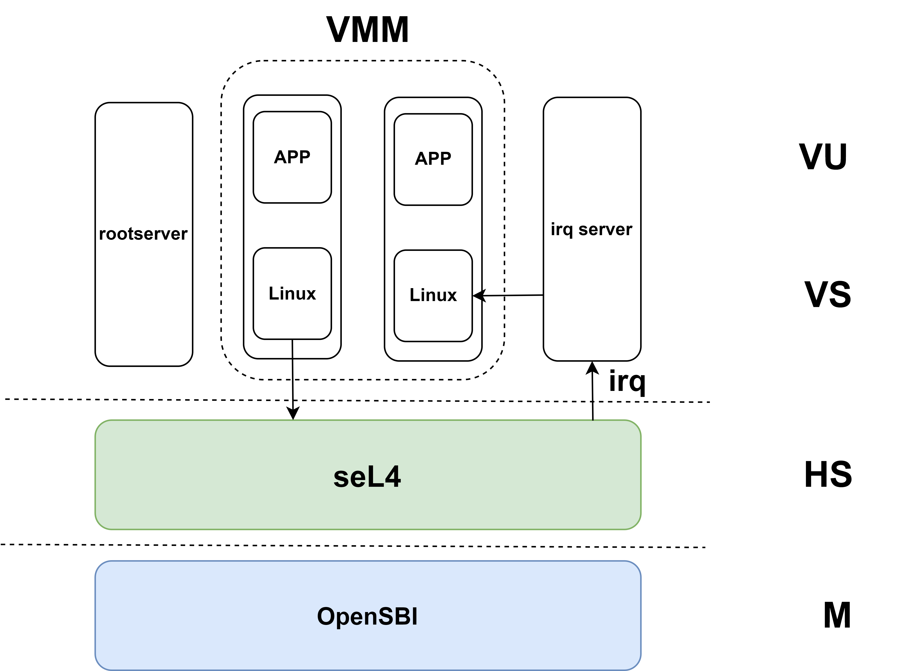

# seL4

本文档的分析主要基于 RISC-V 架构。

## Tutorial

seL4 构建基于多种工具，包括 repo、ninja 等。Tutorial 测例默认在 x86 架构的 QEMU 上运行。

运行 hello-world 退出后报错 `Caught cap fault`，将 return 0 改为执行 exit 后不再出现报错。

ninja 构建 hello-camkes-0 报错 `make: stack: No such file or directory`，一个解决办法是执行 `curl -sSL https://get.haskellstack.org/ | sh` 安装 haskell-stack，然后报错 Timeout，解决网络问题后可以正常运行。

## Hardware

支持 [Rocket](https://docs.sel4.systems/Hardware/rocketchip.html) 硬件平台。

hardware.yml 给出的硬件描述，以 uintc 为例：

```yml
- compatible:
    - riscv,uintc0
  regions:
    - index: 0
      kernel: UINTC_PPTR
      kernel_size: 0x4000
      user: true
```

其中 kernel 字段表示内核映射后的 device 起始地址。

## Capability

    A capability is a unique, unforgeable token that gives the possessor permission to access an entity or object in system. 

**Capability (cap)** 是 seL4 的核心机制，通过唯一且不可伪造的 token 来获取对象的访问权限，可以将 cap 视为带有访问控制的指针。

**root task** 在初始化时会获取所有资源的 cap ，例如 `seL4_CapInitThreadTCB`，可以通过 API 读取或修改 TCB 的内容。

**CSpace** 表示一个 thread 持有的全部 cap 。

**CNodes & CSlots**：可以将 CNode 视为 cap 数组，数组元素被称为 CSlot ，CSlot 可以看成是 `Option<Cap>` 类型。`1 << info->CNodeSizeBits` 表示数组大小，`1 << seL4_SlotBits` 表示 CSlot 大小。每个 thread 的 TCB 中有一个 CNode cap ，即 CSpace root 。Invocation 会隐式地通过 CSpace root 访问 CNode ，并通过其中的 CSlot 访问资源。可以通过以下字段寻址 CSlot：
  
  - _service/root：对应的 CNode cap
  - index：CSlot 在 CNode 中的下标
  - depth：默认为 `seL4_WordBits` （寻址 `index << seL4_WordBits`）
  
以 root task 为例， 访问 TCB 的过程大致为 `seL4_CapInitThreadCNode -> CNode -> seL4_CapInitThreadTCB -> TCB` 。`seL4_bootInfo` 描述了初始 CSpace 中的 cap 和空闲 CSlot 。

## TCB

从 `struct tcb` 出发，分析其成员的含义：

- `arch_tcb_t tcbArch`：arch 相关的状态，主要包含上下文的内容。逐级展开可以的得到 `word_t registers[n_contextRegisters]`，相关定义位于 `enum _register`，除了 31 个通用寄存器外（不包括 zero），还包含 `sstatus` 和 `scause` 等，可以在其中加入其他需要保存和恢复的用户态寄存器。
- `thread_state_t tcbState`：线程状态，主要包括：
  - `ThreadState_Inactive`
  - `ThreadState_Running`
  - `ThreadState_Restart`
  - `ThreadState_BlockedOnReceive`
  - `ThreadState_BlockedOnSend`
  - `ThreadState_BlockedOnReply`
  - `ThreadState_BlockedOnNotification`
- `notification_t *tcbBoundNotification`：指向该线程对应的 Notification ，若该指针非空，该线程可以接收 Signalsh ceshce
- `seL4_Fault_t tcbFault`：
- `lookup_fault_t tcbLookupFailure`：
- `dom_t tcbDomain`：
- `prio_t tcbMCP`：
- `prio_t tcbPriority`：线程优先级
- `sched_context_t *tcbSchedContext`：该线程对应的调度上下文，若该指针为空，线程不可被加入调度队列
- `sched_context_t *tcbYieldTo`：线程切换至的调度上下文
- `word_t tcbIPCBuffer`：用户空间的 IPC 缓冲区的虚拟地址
- `word_t tcbAffinity`：正在运行该线程的核号
- `struct tcb *tcbSchedNext, *tcbSchedPrev`：调度队列的链表指针
- `struct tcb *tcbEPNext, *tcbEPPrev`：Notification 队列的链表指针

实际的 TCB 还包括头部的 `cte_t` ，`tcb_t` 默认占据 TCB 的后半部分空间。

```c
// A diagram of a TCB kernel object that is created from untyped:
//  _______________________________________
// |     |             |                   |
// |     |             |                   |
// |cte_t|   unused    |       tcb_t       |
// |     |(debug_tcb_t)|                   |
// |_____|_____________|___________________|
// 0     a             b                   c
// a = tcbCNodeEntries * sizeof(cte_t)
// b = BIT(TCB_SIZE_BITS)
// c = BIT(seL4_TCBBits)
```

常用内核函数：

- `void tcbEPDequeue(tcb_t *tcb, tcb_queue_t queue)`：将当前 TCB 从队列（EP 或 Ntfn 的等待队列）中移除
- `cpu_id_t getCurrentCPUIndex(void)`：从 `sscratch` 寄存器中读出当前核号
- `void tcbSchedEnqueue(tcb_t *tcb)`：将 TCB 置于调度队列的头部
- `void tcbSchedAppend(tcb_t *tcb)`：将 TCB 置于调度队列的头部
- `void remoteQueueUpdate(tcb_t *tcb)`：发送 `ipiReschedulePending` 更新目标核的调度目标
- `void setRegister(tcb_t *thread, register_t reg, word_t w)`：设置寄存器`thread->tcbArch.tcbContext.registers[reg] = w`
- `NODE_STATE(ksCurThread)`：获取当前正在运行的 TCB （多用于系统调用）

## MCS

## IPC

> [这篇文章](https://microkerneldude.org/2019/03/07/how-to-and-how-not-to-use-sel4-ipc/)辨析了 seL4 IPC 机制。

seL4 中的 IPC 机制可以在线程之间传递消息（**endpoint**结构），也可以让线程和内核服务进行通信（其他内核结构）。IPC 传递的消息被保存在 Message Register 中（简称 MR），如果消息长度较短，可直接通过物理寄存器来传递，否则使用 IPC buffer 。消息的元结构为 `seL4_MessageInfo_t` ，包含以下字段：

```
block seL4_MessageInfo {
    field label 52        // 原始信息
    field capsUnwrapped 3 // 
    field extraCaps 2     // cap 数量
    field length 7        // 消息长度
}
```

IPC buffer 结构包含以下字段：

```c
typedef struct seL4_IPCBuffer_ {
    seL4_MessageInfo_t tag;           // 元信息
    seL4_Word msg[seL4_MsgMaxLength]; // 消息内容
    seL4_Word userData;               // 该结构起始地址
    // 发送的 cap 或标识符
    seL4_Word caps_or_badges[seL4_MsgMaxExtraCaps];
    // 以下结构用于定位接收 cap 的 slot
    seL4_CPtr receiveCNode;
    seL4_CPtr receiveIndex;
    seL4_Word receiveDepth;
} seL4_IPCBuffer __attribute__((__aligned__(sizeof(struct seL4_IPCBuffer_))));
```

内核结构包含以下字段：

```
block endpoint {
    field epQueue_head 64       // 等待队列头部
    field_high epQueue_tail 37  // 等待队列尾部
    field state 2               // 当前状态
}

block endpoint_cap {
    field capEPBadge 64          // 标识符，非0标识符不可被修改
    field capType 5              // cap 类型
    field capCanGrantReply 1     //  
    field capCanGrant 1          //
    field capCanReceive 1        // 可以接收
    field capCanSend 1           // 可以发送
    field_high capEPPtr 39       // 指向 endpoint 内核结构
}

block reply_cap {
    field capTCBPtr 64           // 指向绑定的 TCB 
    field capType 5              // cap 类型
    field capReplyCanGrant 1     // 源自 endpoint_cap 的 capCanGrant 字段
#ifndef CONFIG_KERNEL_MCS
    field capReplyMaster 1
#endif
}
```

`state` 字段指定 EP 的三种状态：

- **EPState_Send**：等待队列中有 TCB 等待发送
- **EPState_Recv**：等待队列中有 TCB 等待接收
- **EPState_Idle**：等待队列为空 

IPC 的发送与接收都是阻塞的，也就是说当调用 `seL4_Send` 或 `seL4_Call` 时如果没有接收方，发送方会进入等待队列；当调用 `seL4_Recv` 和 `seL4_ReplyRecv` 时如果没有发送方，接收方会进入等待队列。无写权限的 Send 和 Call 不会触发错误，但是有读权限的 Recv 会触发 `seL4_Fault_*` 错误。IPC 可以发送 cap ，但 sender 必须有 Grant 权限。如果发送了表示内核结构的 cap ，这些额外的 cap 会被标记在 tag 的 capsUnwrapped 字段，只有 badge 被发送，这样接收方的 slot 可以用来保存其他 cap 。

将一次 IPC 发送或接收看成一次事务，该事务是非原子的。也就是说错误发生前的操作可以被正常完成，错误后的操作会被中止。

reply_cap 在发送方调用 `seL4_Call` 时自动生成，其中的 capTCBPtr 字段指向发送方。可以通过 seL4_Reply 直接调用 reply_cap ，也可以通过 seL4_CNode_SaveCaller 将该 cap 保存在其他 slot ，这样可以之后通过 seL4_Send 进行调用。capReplyCanGrant 字段表示是否可以通过 reply_cap 在回复的消息中发送 cap 。对于 reply_cap 的调用一定是非阻塞的，也就是说一定指向某个正在等待回复的 sender 。caller 接收回复的消息和 seL4_Recv 的流程类似。

内核相关函数：

> 注：内核函数参数类型为 `tcb_t *` 时名称却不一样，下面统一为 `tcb_t *tcb`

- `void sendIPC(bool_t blocking, bool_t do_call, word_t badge, bool_t canGrant, bool_t canGrantReply, tcb_t *tcb, endpoint_t *epptr)`：不同的状态处理方法不同：
  - EPState_Idle 和 EPState_Send：如果指定为 blocking ，则将当前 TCB 状态设置为 ThreadState_BlockingOnSend，并设置 blockingObject、blockingIPCBadge、blockingIPCCanGrant、blockingIPCCanGrantReply、blockingIPCIsCall 属性，将该 TCB 放入 EP 等待队列中
  - EPState_Recv：从等待队列头部取出 TCB ，若此时等待队列为空，则转为 EPState_Idle ；调用 `doIPCTransfer`；如果是 IPC Call ，通过 `setupCallerCap` 创建 reply_cap ，否则将目标 TCB 的状态设置为 `ThreadState_Running` 并进行调度
- `void receiveIPC(tcb_t *tcb, cap_t cap, bool_t isBlocking)`：首先检查 TCB 是否有待接收的 Signal ，如果有则优先调用 `completeSignal` （Signal 是消息长度为 0 的 IPC）；不同的状态处理方法不同：
  - EPState_Idle 和 EPState_Recv：如果指定为 blocking ，则将当前 TCB 状态设置为 ThreadState_BlockingOnReceive，设置 blockingObject 和 blokcingIPCCanGrant ，将 TCB 加入 EP 的等待队列中，状态转为 EPState_Recv
  - EPState_Send：从等待队列头部取出 sender ，如果等待队列为空，转为 EPState_Idle 状态；获取 sender 保存的 badge，canGrant，canGrantReply 信息，调用 `doIPCTransfer`；如果是 IPC Call ，通过 `setupCallerCap` 创建 reply_cap ，否则将目标 TCB 的状态设置为 `ThreadState_Running` 并进行调度
- `void cancelIPC(tcb_t *tcb)`：根据 TCB 状态进行判断：
  - ThreadState_BlockOnSend 和 ThreadState_BlockOnReceive：从等待队列中移除该 TCB ，并将 TCB 状态设置为 ThreadState_Inactive
  - ThreadState_BlockedOnNotification：调用 `cancelSignal`
  - ThreadState_BlockedOnReply：移除 reply_cap
- `void cancelAllIPC(endpoint_t *epptr)`：状态转为 EPState_Idle ，清空等待队列，将其中所有 TCB 加入调度队列，状态设置为 ThreadState_Restart 

## Notification

```
block notification {
#ifdef CONFIG_KERNEL_MCS
    field_high ntfnSchedContext 39
#endif
    field_high ntfnBoundTCB 39      // 指向绑定的 TCB
    field ntfnMsgIdentifier 64      // msg 标识符
    field_high ntfnQueue_head 39    // 等待队列头部
    field_high ntfnQueue_tail 39    // 等待队列尾部
    field state 2                   // 当前状态
}

block notification_cap {
    field capNtfnBadge 64      // badge 标识符
    field capType 5            // cap 类型
    field capNtfnCanReceive 1  // 可以接收
    field capNtfnCanSend 1     // 可以发送
    field_high capNtfnPtr 39   // 指向 notification 内核结构
}
```

`state` 字段指定 Notification 的三种状态：

- **NtfnState_Waiting**：TCB 在队列中等待接收信号
- **NtfnState_Active**：TCB 接收到信号但等待队列为空
- **NtfnState_Idle**：以上两种状态之外的状态

内核相关函数：

> 注：内核函数参数类型为 `tcb_t *` 时名称却不一样，下面统一为 `tcb_t *tcb`

- `void bindNotification(tcb_t *tcb, notification_t *ntfnPtr)`：将 notification 绑定到指定的 TCB ，将 ntfnPtr 赋值给 tcbBoundNotification ，将 tcb 赋值给 ntfnBoundTCB 
- `void unbindNotification(tcb_t *tcb)`：取消绑定
- `void sendSignal(notification_t *ntfnPtr, word_t badge)`：不同的状态处理方法不同：
  - NtfnState_Idle：如果绑定到 TCB ，则根据 TCB 当前状态进行判断，若处于 ThreadState_BlockedOnReceive ，切换到该 TCB 开始运行，并设置 badge 标识符，否则转为 NtfnState_Active 状态
  - NtfnState_Waiting：从等待队列中取出一个唤醒并开始执行，如果队列变为空则转为 NtfnState_Idle 状态
  - NtfnState_Active：已经有正在等待响应的 badge 了，直接与当前 badge 进行或操作
- `void receiveSignal(tcb_t *tcb, cap_t cap, bool_t isBlocking)`：根据 cap 获取 Notification 对象指针，不同状态的处理方法不同：
  - NtfnState_Idle 和 NtfnState_Waiting：若采用阻塞方法（isBlocking 为 1），则设置 TCB 状态为 ThreadState_BlockedOnNotification ，并设置 TCB 的 blockingObject 为当前 ntfnPtr ，将 TCB 放到 Ntfn 等待队列尾部等待唤醒，转为 NtfnState_Waiting 状态
  - NtfnState_Active：将 TCB 的 badgeRegister 设置为 ntfnMsgIdentifier ，转为 NtfnState_Idle 状态
- `void cancelSignal(tcb_t *tcb, notification_t *ntfnPtr)`：将 TCB 从 Ntfn 等待队列中移除，若等待队列为空则转为 NtfnState_Idle 状态，将 TCB 当前状态设置为 ThreadState_Inactive
- `void completeSignal(notification_t *ntfnPtr, tcb_t *tcb)`：若当前状态为 NtfnState_Active ，则
设置对应 tcb 的 badge 寄存器，转为 NtfnState_Idle
- `void cancelAllSignals(notification_t *ntfnPtr)`：状态转为 NtfnState_Idle ，清空等待队列，将其中所有 TCB 加入调度队列，状态设置为 ThreadState_Restart

## IRQ

相关 Cap 如下：

- **IRQControl**：由 root 进行管理，不可被复制
- **IRQHandler**：通过调用 IRQControl 获取对应中断的访问权限，可以被复制；通过 `seL4_IRQControl_Get(seL4_IRQControl _service, seL4_Word irq, seL4_CNode root, seL4_Word index, seL4_Uint8 depth)` 获取

`seL4_IRQHandler_SetNotification` 将 IRQHandler 绑定至 Notification 接收中断，如果想让 Notification 接收多个中断，可以让 badge 绑定至不同的 IRQHandler 。中断可以通过 `seL4_Poll` 或 `seL4_Wait` 来感知。通过 Notification 接收中断并进行处理后，可以通过 `seL4_IRQHandler_Ack` 来响应中断（准备接收下一个中断）或 `seL4_IRQHandler_Clear` 来取消绑定。 

## Boot

从 `head.S` 入手分析 kernel 的启动流程：

```asm
  /* Call bootstrapping implemented in C with parameters:
   *    a0/x10: user image physical start address
   *    a1/x11: user image physical end address
   *    a2/x12: physical/virtual offset
   *    a3/x13: user image virtual entry address
   *    a4/x14: DTB physical address (0 if there is none)
   *    a5/x15: DTB size (0 if there is none)
   *    a6/x16: hart ID (SMP only, unused on non-SMP)
   *    a7/x17: core ID (SMP only, unused on non-SMP)
   */
_start:
  fence.i
.option push
.option norelax
1:auipc gp, %pcrel_hi(__global_pointer$)
  addi  gp, gp, %pcrel_lo(1b)
.option pop

/* 多核下为每个核分配栈空间 */
  la sp, (kernel_stack_alloc + BIT(CONFIG_KERNEL_STACK_BITS))
  csrw sscratch, x0 /* zero sscratch for the init task */
#if CONFIG_MAX_NUM_NODES > 1
  mv t0, a7
  slli t0, t0, CONFIG_KERNEL_STACK_BITS
  add  sp, sp, t0
  csrw sscratch, sp
#endif
  /* 内核初始化 */
  jal init_kernel
  /* 恢复用户态上下文（返回到 root） */
  la ra, restore_user_context
  jr ra

```

## Syscalls

可在[官网](https://docs.sel4.systems/projects/sel4/api-doc.html)查看 API 说明，相关定义位于 libsel4/include/api/syscall.xml 。

seL4 riscv 的 syscall 实现位于 libsel4/arch_include/riscv/sel4/arch/syscalls.h ，对上暴露的 API 保持一致，内部实现 `riscv_sys_send` ，`riscv_sys_send_null` 等函数，这些函数基本的执行逻辑为通过 `ecall` 指令陷入内核并通过寄存器传递参数。以 `seL4_Signal` 为例，目前默认的实现方法为：

```c
LIBSEL4_INLINE_FUNC void seL4_Signal(seL4_CPtr dest)
{
    riscv_sys_send_null(seL4_SysSend, dest, seL4_MessageInfo_new(0, 0, 0, 0).words[0]);
}

static inline void riscv_sys_send_null(seL4_Word sys, seL4_Word src, seL4_Word info_arg)
{
    register seL4_Word destptr asm("a0") = src;
    register seL4_Word info asm("a1") = info_arg;

    /* Perform the system call. */
    register seL4_Word scno asm("a7") = sys;
    asm volatile(
        "ecall"
        : "+r"(destptr), "+r"(info)
        : "r"(scno)
    );
}
```

相当于和 `seL4_Send` 共用了内核接口，换句话说，可以将 `seL4_Signal` 视为消息长度为空的 `seL4_Send` 。

注意到开关 MCS 参数前后，系统调用的实现方式是不一样的，以 `seL4_Poll` 为例：

```c
LIBSEL4_INLINE_FUNC seL4_MessageInfo_t seL4_Poll(seL4_CPtr src, seL4_Word *sender)
{
#ifdef CONFIG_KERNEL_MCS
    return seL4_NBWait(src, sender);
#else
    return seL4_NBRecv(src, sender);
#endif
}
```

内核系统调用处理函数入口为 `exception_t handleSyscall(syscall_t syscall)` 。下面分别对不同系统调用的处理进行分析。

`static exception_t handleInvocation(bool_t isCall, bool_t isBlocking)` 函数主要用来处理 Send 和 Call 等系统调用：

```c
// 获取 a0 和 a1 寄存器中的 cap 和 msg 元信息
seL4_MessageInfo_t info = messageInfoFromWord(getRegister(thread, msgInfoRegister));
cptr_t cptr = getRegister(thread, capRegister);
// 在当前 cspace 中查找 cptr（权限检查）
lookupCapAndSlot_ret_t lu_ret = lookupCapAndSlot(thread, cptr);
// 获取 IPC buffer 的起始地址，对 Buffer 的类型和读写权限进行检查
word_t *buffer = lookupIPCBuffer(false, thread);
// 在 buffer 中遍历 extra caps
exception_t status = lookupExtraCaps(thread, buffer, info);
// 根据 cap 类型进行处理，检查 cap 是否可以发送（CanSend）
status = decodeInvocation(seL4_MessageInfo_get_label(info), length,
                          cptr, lu_ret.slot, lu_ret.cap,
                          isBlocking, isCall, buffer);
```

`static void handleRecv(bool_t isBlocking)` 函数主要用来处理 Recv 和 NBRecv 等系统嗲用：

```c
// 获取 a0 寄存器中的 cap
cptr_t cptr = getRegister(thread, capRegister);
// 在当前 cspace 中查找 cptr（权限检查）
lookupCapAndSlot_ret_t lu_ret = lookupCapAndSlot(thread, cptr);
// 根据 cap 类型进行处理
switch (cap_get_capType(lu_ret.cap)) {
  case cap_endpoint_cap:
    // 检查 ep 是否可以接收（CanReceive）
    receiveIPC(thread, lu_ret.cap, isBlocking);
  case cap_notification_cap:
    // 检查 cap 是否对应该线程绑定的 ntfn
    receiveSignal(NODE_STATE(ksCurThread), lu_ret.cap, isBlocking);
  default:
}
```

## [seL4test](https://github.com/seL4/sel4test/blob/master/docs/design.md)

root 是 sel4test-driver ，启动时获取 `seL4_Bootinfo_t` ，为测例的运行提供环境。bootstrap 运行环境主要是为了测试创建进程和与其通信的功能是否正常。root 通过 linker section 来在运行时选择测例，可以通过字符串匹配在编译期对测例进行选择。测例是依次运行的，root 可以选择是否在测例运行失败后中止测试。

sel4test-driver 运行流程：

```
main ->
  main_continued ->
    sel4test_run_tests ->
      test_types[tt]->run_test(tests[i])
```

sel4test_run_tests 根据 `__start__test_type` 到 `__stop__test_type` 加载 `struct test_type` 信息，对 test 进行过滤后依次运行每个 test （不同 test_type 可以有多个 test）。

ipc.c 测例集中的测例大部分是基于 `test_ipc_pair` 这个函数，下面对代码中的一些关键片段进行分析：

```c
// 分配 endpoint_cap
seL4_CPtr ep = vka_alloc_endpoint_leaky(vka);
// 分配 reply_cap
seL4_CPtr a_reply = vka_alloc_reply_leaky(vka);
// 将当前进程的 cspace 复制到新创建的进程，目的是为了让 sender 和 receiver 间能共享 endpoint
cspacepath_t path;
create_helper_process(env, &thread_a);
vka_cspace_make_path(&env->vka, ep, &path);
thread_a_arg0 = sel4utils_copy_path_to_process(&thread_a.process, path);
// 线程默认共享 cspace ，所以可以直接创建
create_helper_thread(env, &thread_a);
// 设置 sender 的调度优先级
set_helper_priority(env, &thread_a, sender_prio);
// 绑定 sender 运行的核
set_helper_affinity(env, &thread_a, core_a);
// 开始执行线程（进程）
start_helper(env, &thread_a, (helper_fn_t) fa, thread_a_arg0, start_number,
             thread_a_reply, nbwait_should_wait);
```

## [sel4-riscv-vmm](https://github.com/SEL4PROJ/sel4_riscv_vmm/blob/master/src/vmm.c)

该项目还处于试验阶段，支持 v0.6.1 RISC-V Hypervisor 指令扩展。

**irq_server_node**

```c
struct irq_server_node {
/// Information about the IRQ that is assigned to each badge bit
    struct irq_data irqs[NIRQS_PER_NODE];
/// The notification object that IRQs arrive on
    seL4_CPtr notification;
/// A mask for the badge. All set bits within the badge are treated as reserved.
    seL4_Word badge_mask;
};
```

`struct irq_server_node` 维护由该 node 处理的 irq (`struct irq_data`) ，一个 irq 对应 badge 的一位，通过 Notification 从接收 irq ，由 `irq_server_node_handle_irq` 根据 badge 通过调用预先注册的 handler 对所有收到的 irq 进行处理。`irq_bind` 函数根据 irq 序号分配 irq_cap ，并设置 notification_cap 中 badge 的对应位，最后将该 notification_cap 绑定到 irq_cap 。`irq_server_node_register_irq` 注册由该 node 处理的 irq 和 handler。 

**irq_server_thread**

```c
struct irq_server_thread {
/// IRQ data which this thread is responsible for
    struct irq_server_node *node;
/// A synchronous endpoint to deliver IRQ messages to.
    seL4_CPtr delivery_sep;
/// The label that should be assigned to outgoing synchronous messages.
    seL4_Word label;
/// Thread data
    sel4utils_thread_t thread;
/// notification object data
    vka_object_t notification;
/// Linked list chain
    struct irq_server_thread *next;
};
```

函数 `irq_server_thread_new` 初始化内核结构，并创建 irqserver 线程，入口为 `_irq_thread_entry` ，其中 delivery_sep 为可选结构，用来向其他 ep 发送 irq 信息。`_irq_thread_entry` 轮询 notification 消息来获取中断，如果未注册用于同步发送消息的 sep 就直接调用 handler 。

这部分函数比较关键，感觉用户态中断可以支持这部分功能。 

**irq_server**

```c
struct irq_server {
    seL4_CPtr delivery_ep;
    vka_object_t reply;
    seL4_Word label;
    int max_irqs;
    vspace_t *vspace;
    seL4_CPtr cspace;
    vka_t* vka;
    seL4_Word thread_priority;
    simple_t simple;
    struct irq_server_thread *server_threads;
    void *vm;
    /* affinity of the server threads */
    int affinity;
};
```

函数 `irq_server_handle_irq_ipc` 用于其他线程处理 irqserver 以 IPC 形式转发的 irq 信息。函数 `irq_server_register_irq` 先遍历当前 irq nodes 并将 irq 委托给其中一个 thread ，否则创建新的 thread 。函数 `irq_server_new` 初始化 server 结构，如果需要处理默认指定的 irq ，则根据传入的 irq 数量创建 thread 。

函数 `vm_add_vcpu` 在 vm 中添加 vcpu 同时指定核号，配置参数 `CONFIG_PER_VCPU_VMM` 决定是否为每个 vcpu 创建 vmm_thread （源码仓库默认关闭）；此外还包括一些资源分配：为 vcpu 分配 badge 中的一位，创建 TCB 来对 vcpu 进行调度，并将 vcpu 绑定到物理核上。函数 `vm_create` 创建 0 号 vcpu ，并对 fault system 进行初始化。函数 `vmm_init` 对 vmm 进行初始化，boot 参数配置并初始化全局 irq_server 。

`linux_irq` 包括 UART 和每个 vcpu 对应的 VTIMER （vcpu 数量取决于配置参数 `CONFIG_MAX_NUM_NODES`）。当 irq_server 的某个 thread 收到 irq 后，会进入 `irq_handler` 并调用 `vm_inject_IRQ` 将中断注入到对应的 vcpu 中，中断的编号由 token 中包含的 virq 信息指定。

Linux 默认通过 sbi call 来完成 putchar 、settimer、ipi 等操作，在 VM 中会转换为 HYPCALL ，例如 IPI （send 或 clear）就是直接向目标 vcpu 进行注入。

